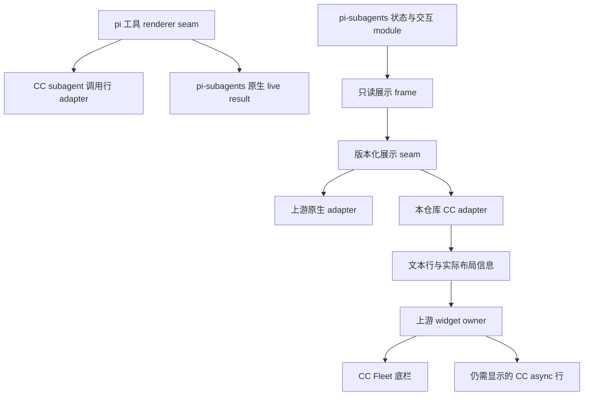
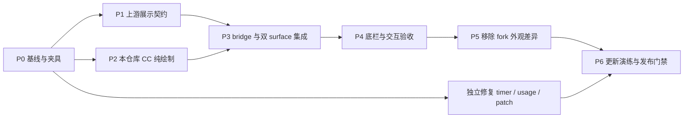

# CC-TUI subagent 展示解耦与架构改进规划

日期：2026-10-05

状态：实现规格草案，尚未实施

范围：本仓库，以及 pi-subagents 必需的展示扩展点

核心验收条件：**subagent 底栏必须呈现 CC-TUI 样式，不能以原生 Fleet 作为项目完成态。**

本规划把 CC 外观的实现集中到 pi-claude-code-tui，让 pi-subagents 继续拥有任务状态、刷新、选择、inspector 与运行控制。工具行沿用 pi 已提供的 renderer interface；底栏通过新增的版本化展示 seam 接入。需要显示的 async 任务也使用 CC 样式，不能只完成聊天调用行而留下原生底栏。

同时安排审查中已复现的编辑器 timer 泄漏、最终回答用量滞后、原型 patch 生命周期问题，以及 result memo 的简化评估。它们可以独立交付，不应让底栏迁移演变成一次大规模重写。

## 1. 基线与事实

| 对象 | 审查基线 | 用途 |
| --- | --- | --- |
| pi-claude-code-tui | 1.8.0，`8581453` | 本规格的主要实施仓库 |
| 本仓库 pi 依赖 | 1.0.1 | renderer、事件顺序与 host 生命周期依据 |
| 相邻 pi-subagents 工作树 | `9157ac4` | 较旧的 surface-tuning 版本，仅作历史比较 |
| 已安装 pi-subagents | `0ebb9c83` | 审查时实际安装副本；当前交互与外观参考 |
| 安装副本对应上游基线 | `8983754b` | 区分 fork 外观改动与上游功能 |

实施前重新记录版本。不能直接在较旧的相邻工作树上删除改动，再把结果覆盖到较新的安装副本。上游改动应在开发 checkout 中完成；已安装目录仅用于验证。

已确认的事实：

1. 工具行已迁移到 `pi.registerToolRenderer`，不再依赖 ToolExecutionComponent 原型 patch。resolver 可以独立选择 call/result/shell。
2. `subagent` 的 rich/live result 通过 `FORCE_RESULT_EXEMPT` 保留上游实现。
3. 底部 Fleet 和 async widget 使用独立的 `setWidget` 路径，工具 renderer 无法替换它们。
4. 底栏的 CC 外观目前分散在 pi-subagents fork；其中还混有 label schema、模型提示、命令过滤及模型可见文本的变化。
5. 当前调用摘要只认识 `workflowScript` / `workflowScriptPath`；安装副本已使用 `workflow: string | true`。例如 `{ workflow: "/tmp/review.ts" }` 会退回 JSON 摘要。
6. Fleet 的 coverage 是 Fleet roster 与 async widget 之间的去重，不能解释成工具 result 卡与底栏的去重。
7. pi 1.0.1 的 widget options 只有 `aboveEditor` / `belowEditor`，没有正式的跨扩展排序配置。

审查验证记录：`npm test` 138 项通过，`npm run typecheck` 通过；默认 statusline 独立运行 50 样本，p50 15.6ms、p95 16.3ms。与测试并行时的 p95 56.4ms 受负载干扰，不能据此判定性能回退。

## 2. 目标与约束

### 2.1 必须实现

- CC-TUI 启用、pi-subagents 提供兼容展示能力时，底部 Fleet 和仍可见的 async 任务行采用 CC 样式。
- 默认可见 roster 不依赖用户先按方向键；进入选择模式只改变选中标记和键盘路由。
- CC 样式代码归本仓库，上游只保留通用展示 seam 与原生 adapter。
- 保留上游的任务可见性、选择、详情查看、状态判断、停止与恢复等现有行为。
- 两个扩展无论先后加载、启停或 reload，都能重新协商展示 ownership。
- 未识别的数据形状、缺失能力、绘制异常不导致 pi 崩溃，也不使后台工作消失。
- 不增加底栏自己的 watcher、轮询器、状态文件扫描或子进程。

### 2.2 显示层红线

本仓库不修改工具 `execute`、参数 schema、工具描述、prompt、会话消息或模型可见 `content`，也不为显示 label 要求模型额外输出字段。

已经存在的 label 可以读；没有 label 时使用 agent、task、workflow 标识等已有信息。不能依赖 fork 的 “Always include label” 提示才能达到可用显示。

共享 workflow formatter 若同时服务 TUI 和工具结果，不能直接改它的用词。CC 的 phase、状态标签等排版由本仓库 adapter 生成。

### 2.3 不做的工作

- 不复制 pi-subagents 的 executor、Fleet controller、job tracker 或整个 `render.ts`。
- 不 monkey-patch 第三方 `setWidget`、工具注册、Fleet prototype 或其私有状态。
- 不在 render 中读 workflow 文件、解析完整 JavaScript、启动进程或调用控制工具。
- 不因本次迁移隐藏 slash commands、改变 agent 发现、调度、权限或费用口径。
- 不将本次实现扩展成通用主题插件框架。

### 2.4 降级与完成态

运行中缺少展示能力或 adapter 出错时，暂时恢复上游原生显示是保护任务可见性的降级措施。降级必须能诊断，并按会话/原因去重提示。

**原生降级不满足本项目验收。** 正式交付必须在明确的兼容版本组合上证明底栏为 CC-TUI 样式。若上游暂未接受展示 seam，则在 fork 中保留一组可独立维护的接口提交，配合本仓库 CC adapter 交付；不能把“等待上游”写成已经完成。

## 3. 目标架构与责任



| 责任 | 所属 module | 说明 |
| --- | --- | --- |
| 任务执行、状态真相、恢复、费用数据 | pi-subagents | CC adapter 不计算另一份任务状态 |
| row identity、父子关系、可选目标、行预算与可见窗口 | pi-subagents 展示 module | adapter 不根据字符串推断对象身份 |
| 选择、焦点路由、inspector、已有鼠标行为 | pi-subagents | native / CC adapter 共用同一套控制逻辑 |
| widget 挂载、更新、dispose、coverage | pi-subagents | coverage 依据实际展示布局计算 |
| CC 字符、颜色、间距、截断、token/time 排列 | 本仓库展示 module | 绘制函数只读取 frame 与当前 theme |
| 版本协商、注册撤回、加载顺序重试 | 本仓库 adapter 与上游注册入口 | 通过窄 interface 协作，不 deep import |
| call 行摘要与 CC `⏺` 外观 | 本仓库工具行 module | 使用官方 renderer seam |
| `cc-footer` 的脚本、模式、提示行 | 本仓库 | 与 Fleet 协作挂载，不取得任务 ownership |

这是一个有两个真实 adapter 的 seam：上游原生展示与 CC 展示。它的 depth 来自对调用者隐藏状态投影、生命周期和去重规则；locality 让外观修改集中在本仓库；leverage 来自两套外观共享上游交互验证。

Deletion test：如果新 module 只是转发到旧的 Fleet 绘制函数，复杂度没有减少；如果需要复制整个 Fleet 才能替换外观，interface 又过宽。目标是复用控制逻辑，只替换绘制决策。

## 4. CC 底栏视觉与交互契约

### 4.1 正常布局

下图是结构示意，不是最终 ANSI golden；实际间距用 `visibleWidth` 计算，具体字节在实现阶段固定。

```text
  ● main
  ○ reviewer  检查展示接口                         8.1k·16s
  ○ workflow  检查兼容性
    ├─ ○ scout  收集宿主约束                       2.4k·8s
    └─ ○ tester  验证 reload                      3.0k·12s
       └─ ✓ 校验完成                              1.1k·4s
```

要求：

- 无原生背景大盒、额外空白 padding 或默认收起的 “N active agents” 替代列表。
- `main` 使用实心标记，agent 使用空心标记；树分支保留明确父子结构。
- label 优先级为已有展示 label、run label、workflow key、task 摘要；隐藏 `[prompt redacted]` 等占位符。
- 不默认堆叠 model、状态、描述等多列；失败、阻塞、暂停等需要行动的状态仍有可识别提示。
- 有可靠用量时右侧使用紧凑 token/time；未知用量不能伪造为 0。workflow 汇总不重复累加子任务费用。
- 活跃任务显示当前 elapsed；已有结束时间的任务冻结时长。完成项保留多久仍由上游决定。
- nested、phase、host-step、project-pane 行必须有明确 CC 显示策略；未知 kind 使用简洁 CC 行并保留身份与状态，不能静默丢弃。

### 4.2 选中与视口

- 顶层预留固定选择位置；选择移动不能使文字或右侧统计跳列。
- 树行在固定标记位置显示选择箭头，不额外插入一列；最终以现有 fork 的可接受效果和 golden 固定。
- `↓/←`、上下移动、Enter、Esc 等沿用上游条件，尤其保留“编辑器为空且拥有焦点才激活”的约束。
- 展示展开与选择激活分开：失焦不能自动把 CC roster 变成原生折叠摘要。
- 保留行数上限和滚动窗口；选中项必须可见，超出预算显示 `↑ N more` / `↓ N more`。
- inspector 打开时的暂时隐藏、关闭后的恢复，以及 widgets suspended 状态由上游处理。
- 不新增与其他扩展争夺的全局快捷键，也不吞掉现有输入。

### 4.3 宽度与主题

- 覆盖 40、60、80、120 列，以及极窄 20 列的无异常降级。
- 先保证标记、任务身份与关键状态可读，再保留 label、token/time；不足时省略次要字段。
- CJK、emoji、ANSI、APC 按可见宽度处理，不按字符串长度判断对齐。
- 使用当前 theme 的语义色，不把 `ctx.ui.theme` 长期捕获到旧闭包。
- dark / light / 缺失色 token 均可读；换主题后重新绘制，不能返回旧 ANSI 缓存。

### 4.4 async widget

只要用户配置允许 async widget，且其中存在 Fleet 没有完整展示的工作，剩余行也必须用同一套 CC 视觉语言。

不能为消除原生样式而强制设置 `asyncWidget: false`；不能因为 Fleet 显示了 workflow 父行，就隐藏没有完整显示的子树。第一版应让同一展示 interface 覆盖 `fleet` 与 `async` 两个 surface，控制与数据仍归原 owner。

用户显式关闭某 surface 时尊重设置，不由 CC-TUI 偷偷重启。该设置属于可见性选择，不影响其余启用 surface 的 CC 样式。

## 5. 上游展示 seam

本节是**待实现的契约设计**。当前 pi-subagents 并不存在可直接调用的 Fleet renderer 注册入口。下述名称均为建议名称，不能在文档或代码中声称已由上游提供。

### 5.1 传输与注册

采用 `pi.events` 上的版本化、进程内注册入口，参考上游已有 inspector 注册方式，但为展示定义独立协议。建议事件族：`pi-subagents:presentation:*:v1`。

不引入 pi-subagents 运行时依赖，不通过安装路径 import 私有类，不依赖 jiti 下单份模块实例。若上游发布类型子路径，可使用导出类型；否则本仓库维护最小 `XxxLike` 镜像并严格门控版本。

注册必须涵盖以下行为，而不是只有一个 renderer callback：

| interface 内容 | 必须表达的语义 |
| --- | --- |
| 能力探测 | 精确协议主版本、支持的 surface、当前 session 与 runtime generation |
| 注册请求 | adapter 身份、session/runtime 所属、支持的 `fleet` / `async`、绘制策略 |
| 接收结果 | 已激活、未就绪、不兼容、ownership 冲突；不能无声覆盖第三方 owner |
| ready / replacement 通知 | 让先加载的消费者补注册，不要求固定加载顺序 |
| 注册凭证 | 可幂等 dispose，旧凭证不能撤回新 runtime 的注册 |
| 绘制失败 | 原生 adapter 暂时接管该 surface、清理 coverage、去重诊断 |

以 `session_start` 为激活点，`disable` / `session_shutdown` 为撤回点；初次 ready 丢失时仍有主动能力查询。非 TUI 不激活。协商不能放到每帧 render 中，也不新增永久重试 timer。

版本不匹配按“不支持”处理，不能接受任意 `version >= 1`。两个 surface 必须都可协商成功，才报告完整的 CC 底栏能力；部分可用可以展示，但不能通过最终门禁。

### 5.2 只读 frame

frame 是经过上游规范化的展示数据，不直接暴露 `SubagentState`、`AsyncJobState` 或内部 Map。它至少需要表达：

| 数据 | 内容 |
| --- | --- |
| 身份 | frame revision、session、runtime generation、surface |
| 逻辑行 | 稳定 row key、kind、父关系、树深度/末子节点标记、可选目标 key |
| 文本材料 | agent identity、已有 label、允许显示的 task 摘要、必要的活动说明 |
| 状态材料 | 原始状态类别、失败/阻塞/暂停标志、开始与结束时间、可靠用量 |
| 展示状态 | selectionActive、selected key、当前可见窗口、overflow 信息 |
| 绘制环境 | width、当前 theme、由 owner 提供的时间/动画帧、显示预算 |

frame 不含可执行控制操作；绘制函数不获知 executor、状态文件路径或完整 prompt。已有脱敏约束继续生效。

一个 row key 必须指向同一个控制目标，不能用截断后的 label 代替 key。adapter 不重排任务生命周期顺序，不自行合并多个历史 tool call。

### 5.3 绘制输出与 coverage

绘制输出不仅需要文本行，还需要与实际物理行对应的布局信息：逻辑 row key、占用行范围、是否完整可读/被截断、overflow 等。

这些数据只用于展示协调，不能成为新的执行状态。上游校验布局与 frame 对应、行范围有效，并用同一次布局计算导航和 coverage。

coverage 必须遵守：

1. 上游已有“哪些 workflow 可以被覆盖”的语义资格判断继续保留。
2. 只有资格满足、所需父子行都实际可见且满足完整性规则，才能隐藏对应 async 树。
3. 截断、overflow、未知 kind、缺失布局或 adapter 异常一律不宣称完整覆盖。
4. coverage 不再错误地依赖 `selectionActive`；CC 默认展开但未进入选择时也要按实际显示结果判断。
5. resize、隐藏、inspector、dispose、session/runtime 变化后重新计算或清空 coverage。
6. 上游协调一次刷新中的两份布局，避免 async 先隐藏、Fleet 后失败造成工作不可见。

不要让 CC adapter 直接调用 `setInlineWorkflowCoverage`，也不要为了计算 coverage 再读一次任务状态。它报告布局事实，owner 决定去重。

### 5.4 快照与缓存失效

展示投影与 revision 的产生同处上游展示 module；不再分别维护“render 用到的字段”和手写 `getRenderKey` 字段名单。

- label、workflow key、nested tokens 等任一可见字段变化都产生新 revision，即使任务不在 running 状态。
- 绘制缓存至少考虑 revision、width、theme generation、adapter generation、选择状态和时间帧；可由 revision 吸收部分维度，但不能遗漏。
- 动画复用上游已有刷新节奏；CC 不再增加 500ms timer。
- 相同 frame 与绘制条件复用结果；不要在 render 内 stringify 整个任务树。
- 宽度与主题变化只重新布局，不扫描磁盘、重新发现 agent 或重新执行状态工具。

## 6. 本仓库实施位置

建议新增两个有明确职责的 module，文件名在实现时可小幅调整：

| 文件 | 职责 |
| --- | --- |
| `extensions/lib/subagent-presentation.ts` | 版本化 bridge、注册/撤回、session/runtime ownership、降级状态；最小协议类型镜像 |
| `extensions/lib/cc-subagent-rows.ts` | subagent 调用摘要、Fleet/async 纯绘制、宽度与布局结果；不持有 pi runtime |
| `extensions/lib/cc-rows.ts` | 保留通用工具行与 gutter 能力；subagent 专用知识移到上述纯 module |
| `extensions/claude-code-tui.ts` | 加载时注册工具 resolver；会话启停桥接；传入当前 theme/显示状态 |
| `test/subagent-presentation.test.ts` | bridge 生命周期与真实注册契约验证 |
| `test/cc-subagent-rows.test.ts` | 当前/历史参数形状、完整性、宽度与 golden |

依赖方向保持入口 → lib。不能为了避免一个文件较长，把 frame、glyph、identity、每种 row 拆成大量只有单一调用者的浅 module。能复用现有宽度函数就复用，不另建布局框架。

### 6.1 call 行迁移

- 保留现有 resolver 的模式决策，不额外重注册 `subagent` 工具。
- 优先识别 action；执行调用读取已有 label，再处理 agent/task、workflow、tasks/chain 等当前形状。
- `workflow: true` 显示 reply-block workflow 标识；路径显示 basename；named resource 显示资源名。
- `tasks` / `chain` 只按已经提供的数据做有界摘要，不尝试执行、求值或推导动态 lane 数。
- 历史 `workflowScript` / `workflowScriptPath` 作为旧会话显示输入继续可读；这是转录兼容，不恢复旧执行参数。
- 不读取 workflow 文件。旧脚本文本采用有界摘要或简短 workflow fallback，不扩展为第二套脚本解析器。
- 不支持的形状避免把整段 JSON 填进标题；优先短而诚实的标识，原始参数保持不变，不承诺上游没有提供的参数展开能力。
- `next().renderResult` 继续用于 subagent live result；未知 details 不触发 CC 猜测状态。

上游已有 `mainWindowRenderer` spacing、collapsed 行数和 `inlineToolDisplay` 配置可继续使用。`summary` 会改变 inline 进度和展开体验，不能作为迁移默认值强推给用户。

### 6.2 开关语义

| 开关/场景 | 工具行 | Fleet / async 底栏 |
| --- | --- | --- |
| CC-TUI on，能力兼容 | 按现有 `/claude-tools` 规则 | 默认注册 CC 展示 |
| `/claude-tools off` | 原生工具行 | 仍为 CC 底栏；它属于整套 TUI 外观 |
| `/claude-tui off` | 新构造工具行退回原生 | 撤回 CC adapter，立即恢复上游展示 |
| `/claude-footer` | 不改变工具行 | 不改变 CC 样式，只影响原生 footer 槽 |
| `fleetView: false` 或 `asyncWidget: false` | 不变 | 尊重用户关闭的 surface |
| 未安装 pi-subagents / 非 TUI | 不额外激活 | 无 bridge、无 timer、无空白占位 |

不新增第五组模式命令。必要的兼容诊断可附在现有命令反馈中，避免让普通用户理解内部协议才能使用底栏。

## 7. 底部排列与挂载生命周期

本项目约束的协作布局是：编辑器下方先显示 CC statusline / mode / hints，再显示尚未被覆盖的 CC async 行和 CC Fleet roster。原生 footer 若被用户显式启用，仍使用 pi 的 footer 槽。

```text
聊天记录
cc-status
编辑器
cc-footer：脚本 + mode/hints
CC async：仅剩余可见任务
CC Fleet：main + agent 树
原生 footer：仅用户显式开启时
```

pi 当前无正式排序 interface，首版采用**双方 owner 协作挂载**，不靠定时器抢 Map 末尾：

1. 本仓库先挂载稳定的 `cc-footer` 展示对象，再注册 subagent 展示 adapter。
2. 上游收到新 adapter generation 后，由自己的 owner 按 async → Fleet 顺序挂载；已有实例必要时只重挂自己的 widget，保留逻辑选择与任务状态。
3. statusline、宽度、偏好变化更新已有对象并 invalidate，不重复 `setWidget` 改变顺序。
4. CC-TUI off → on 走同一协商流程；Fleet 仍存活时也能重建双方相对顺序。
5. 更换 runtime 时先撤回旧 generation；旧 dispose 不能清除新 widget，旧延迟回调不得再挂回。

该保证覆盖 CC-TUI 与 pi-subagents 自己的 surfaces，不承诺压过所有未知扩展后注册的 widget。若将来要求“所有扩展中绝对最后一行”，应单独向 pi 提交显式排序能力，不能为此 patch 它的 widget Map。

## 8. 同期独立修复

### 8.1 编辑器 timer

当前 530ms blink interval 没有释放，也没有 `unref()`；host 替换 editor 不负责清理这个 timer。

让编辑器 module 拥有 timer 的完整生命周期，入口在替换、disable、shutdown 前显式释放旧实例。释放必须幂等；timer 应 unref；失焦规则保持；不依赖垃圾回收，不仅添加一个没有调用者的 `dispose` 方法。

验收：连续启用/停用/reload 20 次，旧实例 timer 数归零；启用期间最多一个 editor blink timer；失焦不请求重绘；释放后的回调不会访问旧 TUI。

### 8.2 用量快照

pi 1.0.1 在 `message_end` 通知扩展后才 appendMessage。当前 handler 读取 branch 会错过本条最终回答，`agent_settled` 也没有补采样。

让用量 module 吸收 host 事件顺序与分支失效知识。首步选择经真实 host 验证的持久化后采样点；至少在 `agent_settled` 后保证最终值正确，工具回合的及时性用已确认的 post-append 事件补齐。不要用未经验证的 microtask/timeout 猜测顺序，也不要把 event message 与 branch 简单相加造成重复计数。

session_start、session_tree、compaction 后的快照失效必须覆盖。先修正确性，再根据长会话测量决定是否增量累计；不能只用 message 数相同判断 branch 未变。

验收：最终 assistant input 100、output 25、cost 0.01，无后续用户消息时也显示 125 / 0.01；切换分支、恢复、压缩后与基于当前 branch 的参考计算一致。

### 8.3 pi 原型兼容 adapter

剩余 patch 对象是 pi 自身的 compaction、skill、user message，不是 subagent 底栏。

集中原方法保存、当前 owner、主题 getter 更新、宿主形状检查、启停恢复与失败降级。重复安装要刷新当前 getter，不能因 marker 直接 return 而永久读第一次闭包。恢复只撤回自己仍拥有的改写，避免覆盖后来其他扩展的修改。

关闭后对新构造/重建的行恢复原生行为；若现有 host 没有刷新全部历史行的正式能力，应明确历史显示刷新限制，不能靠私有树遍历再增加一组 patch。同时检查 markdown transformer 的 enabled gate 与相关主题缓存，避免只恢复 padding 却继续施加 CC 文本变换。

验收覆盖 getter A → B、关闭/再次启用、reload、字段缺失、绘制异常、另一扩展后接管；修正现有被 marker 跳过的 fallback 测试。没有正式 seam 的 pi patch 保留在此 adapter，不能挪作 Fleet 的捷径。

### 8.4 result memo

当前 host 普通 render 保留返回对象，invalidate 时重新构造 result envelope；现有 result 引用 memo 在该路径不命中。

通过真实 ToolExecutionComponent 验证普通帧、partial、invalidate、展开、resize 后，再决定删除无效 memo 或保留有证据的复用。不引入深比较、JSON hash 或全量结果缓存。`ccResult` 的宽度缓存有明确用途，应单独保留。

验收以实际 factory 次数、内存/耗时及 golden 输出为依据。若删除没有收益或影响宿主兼容，记录评估结果即可，不强行完成“删除代码”指标。

## 9. 分阶段交付



| 阶段 | 工作与交付物 | 退出条件 |
| --- | --- | --- |
| P0 | 对齐实际安装与开发基线；盘点 fork diff；保存 Fleet/async/调用行 ANSI 夹具和交互记录 | 每项差异标注视觉/模型契约/控制行为/接口适配；确认本规格视觉要求 |
| P1 | 上游增加版本化展示注册；原生 adapter 先走同一 seam；统一 frame、布局与 coverage | 无 CC-TUI 时原生行为测试通过；两种加载顺序、withdraw、未知版本有契约测试 |
| P2 | 本仓库实现当前 workflow 摘要、CC Fleet/async 纯绘制和布局信息 | 全类型/宽度 golden 通过，无 IO；已有工具行非目标输出不变 |
| P3 | 接入 bridge、双 surface、开关、generation、协作挂载和缓存失效 | 同一任务仅有一份状态 owner；开启 CC-TUI 后两种底栏均为 CC；off 可恢复 |
| P4 | 真实终端、交互、coverage 与性能验收 | §10 的关键矩阵全通过，有实际终端记录；不能只看截图 |
| P5 | 从 fork 删除已被 adapter 替代的 CC 绘制、脚本 manifest 解析与相关旧测试 | 本次视觉集成仅剩必要接口差异；非视觉定制未被误删；同组基线 fixture 保持目标外观 |
| P6 | 在当前上游基线重放窄接口提交，运行跨包测试、安装/reload 演练，更新兼容说明 | 明确版本组合；无底栏降级；功能与性能门禁通过 |

独立修复以小提交推进：editor timer → usage 一致性 → pi patch 生命周期。memo 评估优先级最低。它们不依赖 P1，但最终发布要把已确认问题的处理状态写清楚。

建议 PR/提交拆分：上游 seam、CC 摘要与绘制、bridge/布局集成、fork 外观删除、editor fix、usage fix、pi compatibility fix。不要把上游协议和全部 fork 清理合为一个大提交。

## 10. 测试与性能门禁

### 10.1 自动化矩阵

| 维度 | 必测情况 | 验证结果 |
| --- | --- | --- |
| 加载顺序 | CC 先、subagents 先、subagents 晚 ready | 同一最终 CC 展示；一次有效注册 |
| 生命周期 | off/on、reload、session replace、旧 dispose 晚到 | 无旧 ctx、无孤儿订阅、无重复 widget/timer |
| 协议失败 | 缺失版本、不兼容、owner 冲突、callback throw、无效布局 | 保留任务可见性；清 coverage；诊断去重 |
| 工具记录 | 当前 workflow、旧记录、label 缺失、action、tasks/chain、未知字段 | 有界摘要；原执行与模型输入/结果不变 |
| 任务种类 | foreground、async、workflow、nested、host step、project pane | 不误丢任务或混淆目标 key |
| 状态 | queued、running、blocked、failed、paused、stopped、completed | 关键状态可见；已结束时长不持续增长 |
| 显示变化 | 只改 label/workflow key/nested tokens，且任务非 running | revision 变化并触发刷新，不依赖动画掩盖漏刷新 |
| coverage | 全部可见、缺子节点、窄屏截断、overflow、inspector、adapter 错误 | 只有完整覆盖才去重；未知情况保留 async |
| 选择 | 进入/退出选择、逐行移动、滚动窗口、Enter 目标 | 行位置稳定；目标身份正确；空编辑器门控保留 |
| 开关组合 | tools off、footer on/off、statusline on/off、禁用某 surface | 底栏样式不被无关开关改回原生 |
| 主题与宽度 | CJK/emoji/APC、20–120 列、theme change | 可见宽度合法，无缓存旧色与残留行 |

测试通过与生产相同的 interface。bridge 使用进程内事件 adapter 测试独立模块实例，不只调用内部 helper；宿主行为测试要覆盖真实 resolver 和事件顺序。

在上游用原生与 CC 两个 adapter 跑相同的控制/coverage 测试。不能让上游 fixture 默认为 CC 输出来掩盖原生回退。视觉 golden 可以不同，执行和目标身份必须相同。

### 10.2 性能约束

硬约束：

- render 路径不 spawn、不读文件、不做状态 RPC、不扫描任务目录。
- CC bridge 不新增轮询 timer；使用上游已有刷新，所有新生命周期资源可撤回。
- 绘制成本随实际展示行数增长；隐藏的大量历史任务不在每帧重新投影。
- frame 不变时复用布局；更新只失效相关 surface，不强制重绘整个终端。

测量方案：

1. 在同一机器、相同数据、非并行测试负载下，分别记录原生与 CC 的 1/10/50 个任务、深度 1/3 的投影与绘制 p50/p95。
2. 冷帧、缓存帧、状态更新、resize 分开测；同时统计全量投影次数、requestRender 次数、活跃 timer/订阅数量。
3. 暂定新增纯绘制开销 p95 不超过 2ms；总刷新 p95 相对原生增长不超过 20% 或 1ms（取较宽者）。这些是实施目标，不是已测结果；P0 保存基线后确认，不能事后为失败放宽。
4. 20 次启停/reload 后资源数不增长；无状态变化且无动画时不产生额外刷新。
5. 重跑 `node scripts/bench-statusline.mjs`，默认 p95 < 50ms；失败先排除并行负载后再判断。

本仓库每个代码提交必须 `npm test` 与 `npm run typecheck` 双绿；上游改动运行该 checkout 的相关测试与 typecheck，并记录既有失败，不能把新增失败归入旧问题。

### 10.3 真实终端验收

- [ ] CC-TUI + 兼容 pi-subagents，创建真实 foreground/async/workflow 工作，底栏显示 CC main/agent 树。
- [ ] 未进入选择时也显示 roster；移动选择没有列跳动，Enter/退出行为正确。
- [ ] 出现 Fleet 未完整覆盖的任务时，剩余 async 行仍可见且是 CC 样式。
- [ ] 收窄/放宽、中文 label、主题切换没有越界、残影或任务消失。
- [ ] 开关 tools/footer/statusline 不破坏 CC 底栏；总开关 off/on 能恢复两套展示。
- [ ] 活跃子任务运行中 reload，状态和控制目标仍正确，无重复底栏或旧回调。
- [ ] 无 CC-TUI 时上游原生外观、交互与快捷键保持正常。

## 11. fork 清理与更新策略

P0 将 surface-tuning 差异分成三份清单：

| 类别 | 例子 | 处理方式 |
| --- | --- | --- |
| 纯视觉 | CC call、row skeleton、glyph、phase 文案、token/time 排列 | 搬入本仓库 adapter，验收后删除 fork 对应实现 |
| 通用展示能力 | frame、renderer 注册、layout/coverage、dispose | 做成独立接口提交，优先提交上游；合并前有限维护 |
| 非视觉定制 | label schema/prompt、命令过滤、模型可见 checklist 文本 | 从本次迁移隔离；记录去留，不自动迁入或自动删除 |

不能按提交标题包含 `surface-tuning` 就整批 revert。某些提交混合上述三类，需要逐项移除。尤其检查 formatter 是否也被工具 `content` 路径复用。

上游更新演练使用干净开发 checkout：先验证原生 adapter，再验证 CC；协议主版本不变时 CC adapter 不应因私有字段重命名而修改。若一次普通上游更新仍要求更改本仓库对内部 Map、私有类或文件路径的访问，说明 seam 没有达到目标。

上游未合并时记录最小接口提交列表与基线，避免自动修改用户安装目录。发布说明必须列出经过验证的 pi / pi-subagents 组合及所需接口提交；主版本不兼容时安全降级，但不得宣称该组合支持 CC 底栏。

## 12. 完成定义

- [ ] CC 底栏视觉与交互契约通过 golden 和真实终端验证；Fleet 与可见 async 行都覆盖。
- [ ] 工具执行、schema、prompt、模型可见内容不因 CC adapter 改变。
- [ ] 上游状态、控制、订阅和任务文件读取保持单一 owner。
- [ ] 调用行适配当前 workflow 形状，并能显示旧会话记录。
- [ ] coverage、选择与缓存失效共用实际展示事实，不再依赖旧折叠状态假设。
- [ ] 兼容性失败可诊断且后台工作不丢失；正常验收组合没有原生底栏降级。
- [ ] 已迁移的 fork 视觉差异删除，剩余通用接口与非视觉定制各有清单。
- [ ] timer、usage、pi patch 的独立修复有行为验证；memo 评估有结论。
- [ ] 所有适用测试、typecheck、性能门禁与上游更新演练完成。
- [ ] README、架构文档和人工验证清单反映真实实现；不沿用已过期的 prototype/每帧调用说明。

## 13. 代码依据

本仓库：

- [renderer 接线与生命周期](../extensions/claude-code-tui.ts)
- [接管规则与 result 豁免](../extensions/lib/takeover-rules.ts)
- [现有 subagent 摘要与 result memo](../extensions/lib/cc-rows.ts)
- [编辑器动画](../extensions/lib/claude-tui-editor.ts)
- [用量快照](../extensions/lib/status-snapshot.ts)
- [compaction patch](../extensions/lib/cc-compaction-row.ts) 与 [skill patch](../extensions/lib/cc-skill-row.ts)
- [现有架构](../docs/ARCHITECTURE.md) 与 [人工验证清单](../docs/manual-verification.md)

pi-subagents 安装快照 `0ebb9c83` 的重点位置：`src/tui/fleet-status.ts`（投影、刷新、选择、coverage、绘制），`src/tui/render.ts`（async widget），`src/extension/index.ts`（调用行与 manifest IO），`src/extension/schemas.ts`（workflow 形状），`src/api/inspectors.ts`（已有版本化注册先例），`SPEC-upstream-sync.md`（已知 fork 适配问题）。这些是证据位置，不是本仓库可依赖的运行时 import 路径。

公开说明：[pi 扩展与工具 renderer](https://github.com/earendil-works/pi/blob/main/packages/coding-agent/docs/extensions.md)、[pi-subagents 显示配置](https://github.com/nicobailon/pi-subagents/blob/main/docs/configuration.md)、[pi-subagents 可观测性](https://github.com/nicobailon/pi-subagents/blob/main/docs/observability.md)。公开 main 会变化，具体实施以 P0 固定版本为准。
